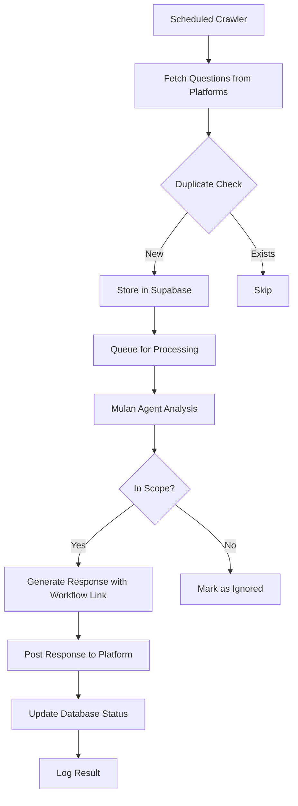

# Mulan-Marketing-Agent

An automated system that crawls social media platforms (Quora, Reddit, etc.) for AI video-related questions, stores them in a database, processes them through an AI agent (Mulan Agent) to determine if they're answerable, and automatically posts responses with workflow links.

## Table of Contents

- [Features](#features)
- [Tech Stack](#tech-stack)
- [Project Structure](#project-structure)
- [Database Schema](#database-schema)
- [System Workflow](#system-workflow)
- [Prerequisites](#prerequisites)
- [Installation](#installation)
- [Configuration](#configuration)
- [Usage](#usage)
- [Development](#development)
- [Deployment](#deployment)
- [Contributing](#contributing)
- [License](#license)

## Features

- 🤖 **Multi-platform Crawling**: Automated collection from Reddit, Quora, and extensible to other platforms
- 🧠 **AI Agent Integration**: Smart question filtering via Mulan Agent
- 💬 **Auto-Response**: Automatic reply posting with workflow links
- 🔄 **Deduplication**: Prevents processing duplicate questions
- ⚡ **Real-time Updates**: Live dashboard updates via Supabase
- 📊 **Analytics Dashboard**: Monitor crawling performance and agent responses
- 🛡️ **Rate Limiting**: Respects platform API limits
- 🔍 **Error Tracking**: Comprehensive logging and monitoring

## Tech Stack

### Backend/Crawler
- **Language**: Python 3.11+
- **Web Scraping**: 
  - `praw` (Python Reddit API Wrapper)
  - `quora-api` or Selenium for Quora
  - `beautifulsoup4` + `requests`
- **Task Scheduling**: 
  - `celery` + Redis for distributed task queue
  - `APScheduler` for cron-like scheduling
- **API Framework**: FastAPI
- **AI Agent Integration**: `httpx` for Mulan Agent communication

### Database
- **Primary Database**: Supabase (PostgreSQL-based)
- **Cache Layer**: Redis
- **Alternative Options**: PostgreSQL (self-hosted), MongoDB

### Frontend (Optional Dashboard)
- **Framework**: React + TypeScript / Next.js
- **UI Library**: Tailwind CSS + shadcn/ui
- **Features**: Monitoring, analytics, manual intervention

### Infrastructure & DevOps
- **Containerization**: Docker + Docker Compose
- **Deployment**: Cloud Run / AWS ECS (backend), Vercel/Netlify (frontend)
- **Monitoring**: Sentry for errors, Grafana for metrics
- **Version Control**: Git

## Project Structure

```
ai-video-qa-system/
├── backend/
│   ├── crawler/
│   │   ├── __init__.py
│   │   ├── base_crawler.py          # Abstract crawler class
│   │   ├── reddit_crawler.py        # Reddit-specific implementation
│   │   ├── quora_crawler.py         # Quora-specific implementation
│   │   └── crawler_manager.py       # Orchestrates all crawlers
│   ├── agent/
│   │   ├── __init__.py
│   │   ├── mulan_client.py          # Client to communicate with Mulan Agent
│   │   ├── response_generator.py    # Formats and posts responses
│   │   └── capability_checker.py    # Determines if question is answerable
│   ├── database/
│   │   ├── __init__.py
│   │   ├── models.py                # SQLAlchemy/Pydantic models
│   │   ├── supabase_client.py       # Supabase connection & queries
│   │   └── migrations/              # Database migration scripts
│   ├── api/
│   │   ├── __init__.py
│   │   ├── main.py                  # FastAPI app entry point
│   │   ├── routes/
│   │   │   ├── questions.py         # CRUD for questions
│   │   │   ├── responses.py         # Response management
│   │   │   └── analytics.py         # Statistics endpoints
│   │   └── dependencies.py          # Shared dependencies
│   ├── tasks/
│   │   ├── __init__.py
│   │   ├── celery_app.py           # Celery configuration
│   │   ├── crawl_tasks.py          # Scheduled crawling tasks
│   │   └── response_tasks.py       # Auto-response tasks
│   ├── utils/
│   │   ├── __init__.py
│   │   ├── logger.py               # Logging configuration
│   │   ├── rate_limiter.py         # Rate limiting logic
│   │   └── deduplicator.py         # Duplicate detection
│   ├── config/
│   │   ├── __init__.py
│   │   └── settings.py             # Environment variables & config
│   ├── requirements.txt
│   └── Dockerfile
├── frontend/                        # Optional dashboard
│   ├── src/
│   │   ├── components/
│   │   ├── pages/
│   │   ├── hooks/
│   │   └── lib/
│   ├── public/
│   ├── package.json
│   └── Dockerfile
├── scripts/
│   ├── setup_db.py                 # Initialize database schema
│   └── seed_data.py                # Seed test data
├── tests/
│   ├── test_crawlers.py
│   ├── test_agent.py
│   └── test_api.py
├── docker-compose.yml
├── .env.example
└── README.md
```

## Database Schema

### Tables

#### `questions`
| Column | Type | Description |
|--------|------|-------------|
| `id` | UUID | Primary key |
| `platform` | ENUM | reddit, quora, etc. |
| `post_id` | STRING | Unique per platform |
| `title` | TEXT | Question title |
| `content` | TEXT | Question body |
| `author` | STRING | Username |
| `url` | STRING | Original post URL |
| `tags` | ARRAY | Related tags |
| `upvotes` | INTEGER | Score/upvotes |
| `status` | ENUM | pending, processing, answered, ignored |
| `created_at` | TIMESTAMP | Original post date |
| `crawled_at` | TIMESTAMP | When crawled |

#### `comments`
| Column | Type | Description |
|--------|------|-------------|
| `id` | UUID | Primary key |
| `question_id` | UUID | Foreign key → questions |
| `comment_id` | STRING | Unique per platform |
| `content` | TEXT | Comment text |
| `author` | STRING | Username |
| `upvotes` | INTEGER | Score/upvotes |
| `created_at` | TIMESTAMP | Comment date |

#### `agent_responses`
| Column | Type | Description |
|--------|------|-------------|
| `id` | UUID | Primary key |
| `question_id` | UUID | Foreign key → questions |
| `is_in_scope` | BOOLEAN | Can agent answer? |
| `confidence_score` | FLOAT | Agent confidence |
| `workflow_link` | STRING | Link to workflow |
| `response_text` | TEXT | Generated response |
| `posted` | BOOLEAN | Posted successfully? |
| `posted_at` | TIMESTAMP | When posted |
| `created_at` | TIMESTAMP | Response generated |

#### `crawl_logs`
| Column | Type | Description |
|--------|------|-------------|
| `id` | UUID | Primary key |
| `platform` | STRING | Platform name |
| `status` | ENUM | success, failure |
| `items_found` | INTEGER | Questions found |
| `error_message` | TEXT | Error details |
| `started_at` | TIMESTAMP | Crawl start time |
| `completed_at` | TIMESTAMP | Crawl end time |

## System Workflow



### Phases

1. **Crawling Phase**
   - Scheduled tasks run every X hours
   - Crawlers fetch new questions from each platform
   - Deduplication check against existing posts
   - Store questions + comments in Supabase

2. **Processing Phase**
   - Celery worker picks up new questions
   - Send question to Mulan Agent API
   - Agent determines if question is in scope
   - If yes: generate response with workflow link

3. **Response Phase**
   - Format response according to platform requirements
   - Post response via platform API
   - Update database with response status
   - Log success/failure

4. **Monitoring Phase**
   - View crawling statistics via dashboard
   - Review pending questions
   - Manual approval workflow (optional)
   - Performance analytics

## Prerequisites

- Python 3.11+
- Node.js 18+ (for frontend)
- Docker & Docker Compose
- Redis 7+
- Supabase account (or PostgreSQL 14+)
- Platform API credentials:
  - Reddit API key
  - Quora credentials (if using their API)
- Mulan Agent API endpoint and credentials

## Installation

### 1. Clone the Repository

```bash
git clone https://github.com/yourusername/ai-video-qa-system.git
cd ai-video-qa-system
```

### 2. Backend Setup

```bash
cd backend

# Create virtual environment
python -m venv venv
source venv/bin/activate  # On Windows: venv\Scripts\activate

# Install dependencies
pip install -r requirements.txt
```

### 3. Frontend Setup (Optional)

```bash
cd frontend
npm install
```

### 4. Docker Setup

```bash
# Start all services
docker-compose up -d
```

## Configuration

### 1. Environment Variables

Copy `.env.example` to `.env` and configure:

```env
# Database
SUPABASE_URL=your_supabase_url
SUPABASE_KEY=your_supabase_key
REDIS_URL=redis://localhost:6379

# Reddit API
REDDIT_CLIENT_ID=your_reddit_client_id
REDDIT_CLIENT_SECRET=your_reddit_secret
REDDIT_USER_AGENT=your_app_name

# Quora (if using official API)
QUORA_API_KEY=your_quora_key

# Mulan Agent
MULAN_AGENT_URL=https://mulan-agent.example.com
MULAN_AGENT_API_KEY=your_mulan_key

# Celery
CELERY_BROKER_URL=redis://localhost:6379/0
CELERY_RESULT_BACKEND=redis://localhost:6379/0

# Monitoring
SENTRY_DSN=your_sentry_dsn

# Rate Limiting
CRAWL_INTERVAL_HOURS=6
MAX_REQUESTS_PER_MINUTE=30
```

### 2. Initialize Database

```bash
python scripts/setup_db.py
```

## Usage

### Start the Crawler

```bash
# Start Celery worker
celery -A backend.tasks.celery_app worker --loglevel=info

# Start Celery beat (scheduler)
celery -A backend.tasks.celery_app beat --loglevel=info
```

### Start the API Server

```bash
cd backend
uvicorn api.main:app --reload --host 0.0.0.0 --port 8000
```

### Start the Frontend Dashboard

```bash
cd frontend
npm run dev
```

Access the dashboard at `http://localhost:3000`

### Manual Crawl Trigger

```bash
# Trigger Reddit crawl
curl -X POST http://localhost:8000/api/crawl/reddit

# Trigger Quora crawl
curl -X POST http://localhost:8000/api/crawl/quora
```

## Development

### Run Tests

```bash
# Backend tests
cd backend
pytest

# Frontend tests
cd frontend
npm test
```

### Code Quality

```bash
# Linting
flake8 backend/
pylint backend/

# Formatting
black backend/
isort backend/

# Type checking
mypy backend/
```

### Adding a New Platform Crawler

1. Create new crawler in `backend/crawler/`
2. Inherit from `BaseCrawler`
3. Implement required methods: `fetch_questions()`, `fetch_comments()`
4. Register in `crawler_manager.py`
5. Add platform credentials to `.env`

## Deployment

### Using Docker Compose

```bash
docker-compose -f docker-compose.prod.yml up -d
```

### Cloud Deployment

**Backend (Cloud Run / ECS)**
```bash
# Build and push image
docker build -t gcr.io/your-project/ai-video-qa-backend:latest ./backend
docker push gcr.io/your-project/ai-video-qa-backend:latest

# Deploy to Cloud Run
gcloud run deploy ai-video-qa-backend \
  --image gcr.io/your-project/ai-video-qa-backend:latest \
  --platform managed \
  --region us-central1
```

**Frontend (Vercel)**
```bash
cd frontend
vercel --prod
```

## Development Phases

- [x] **Phase 1**: Core crawler + database setup
- [ ] **Phase 2**: Mulan Agent integration
- [ ] **Phase 3**: Auto-response system
- [ ] **Phase 4**: Monitoring dashboard
- [ ] **Phase 5**: Testing & deployment

## Contributing

1. Fork the repository
2. Create your feature branch (`git checkout -b feature/AmazingFeature`)
3. Commit your changes (`git commit -m 'Add some AmazingFeature'`)
4. Push to the branch (`git push origin feature/AmazingFeature`)
5. Open a Pull Request

## License

This project is licensed under the MIT License - see the [LICENSE](LICENSE) file for details.

## Support

For questions or issues:
- Open an issue on GitHub
- Contact: your-email@example.com

## Acknowledgments

- Mulan Agent team for AI processing
- Supabase for database infrastructure
- Reddit and Quora for platform APIs
